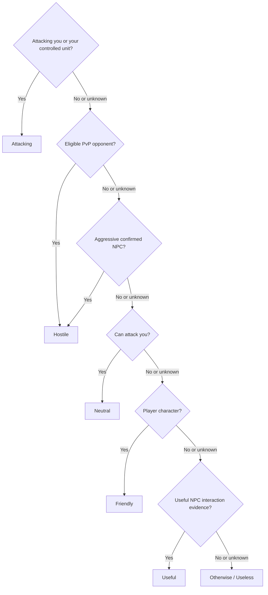
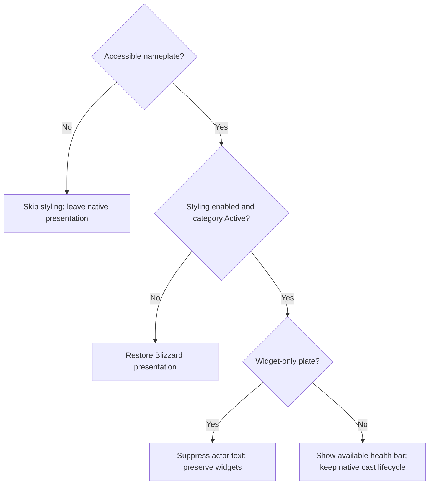

# Onscreen entity evaluation

Updated 2026-10-04 for 1.0.162. This document describes the actual runtime order. It does not propose a different tree or change classification behavior.

## Runtime entry and frame checks

Startup checks setting compatibility before normal styling. Events, queued refreshes, and Blizzard update hooks feed the styling path. A full `NameplatePresentation.ApplySimpleStyle` pass runs in this order:

1. Get the current world context and inspect the frame's accessibility. Return if inaccessible.
2. Return while that frame is being restored, or if its readable unit token is not a `nameplateN` token.
3. If the frame belongs to a different original unit, restore it and inspect accessibility again. Return if restoration or access is unavailable.
4. Collect entity facts and classify them using the tree below.
5. Resolve context, color, category mode, and presentation policy using the presentation tree below.
6. For a non-style decision, request restoration and return. For a change into or out of text suppression, restore the prior presentation first.
7. Capture original values and save the selected state/decision. A widget-only decision suppresses actor text and returns.
8. Apply ordinary bar/indicator visibility, name/title styling, supported health-bar color, threat text, and cast highlighting, in that order.

`RefreshUnit` looks up a supplied plate before this pass; missing frames are queued for later retry. The half-second reconciliation can repair current cached name styling without recollecting/classifying every entity. If cache repair cannot handle drift, it invokes a full styling pass. `/snp debug` separately collects target facts even when no plate exists, explaining why it can report Friendly for an entity that cannot be styled.

## Facts and classification

`EntityFacts.Collect` gathers identity, ownership/control, faction/reaction, directional attack permissions, sanctuary/combat context, threats/targets, widgets-only status, and NPC interaction/title evidence. Facts can be unknown. `NameplateClassification.Classify` then checks the following questions in order, stopping at the first Yes:

| Order | Test | Category |
| --- | --- | --- |
| 1 | Attacking you or your controlled unit | Attacking |
| 2 | Eligible PvP opponent | Hostile |
| 3 | Aggressive confirmed NPC | Hostile |
| 4 | Can attack you | Neutral |
| 5 | Player character | Friendly |
| 6 | Useful NPC interaction evidence | Useful |
| 7 | No earlier test matched | Useless |

A PC means an actual player character, not its pet, guardian, or minion. Player control and ownership remain separate facts. An eligible player-controlled PvP opponent can therefore enter Hostile without being a PC. Unknown identity must not become a confirmed NPC merely because the PC test is unreadable.

Faction, sanctuary, PvP flags, and desired War Mode are separate observations. An opposite-faction PC is still Friendly when no higher priority applies. Sanctuary normally removes player attack eligibility, but it does not remove NPC danger checks. Readable actual attack permission remains authoritative, including special cases such as duels. A title or friendly reaction alone does not prove that an NPC is useful. The Useless fallback means no earlier rule matched; unknown facts do not establish non-usefulness.

## Context and presentation

Classification answers what the entity is doing. Priority determines color; all ordinary Active plates use a uniform bar policy. Frame access determines whether anything can actually be changed.

`PresentationRules.Resolve` retains the priority color and uses this order:

| Context | Color after classification |
| --- | --- |
| Any danger category | Its danger color, including in sanctuary |
| Sanctuary, same-faction Friendly PC | Shared Friendly color; green by default |
| Useful category, any context | Shared Useful color; light grey by default |
| Useless category, any context | Shared Useless color; medium grey by default |
| Sanctuary, opposite-faction PC | Existing category color if an accessible plate exists; native overhead label otherwise |
| Other or unknown context/identity | Existing category color; no inferred sanctuary override |

After the presentation decision, `NameplateText` chooses the effective name/title font. In sanctuary with the profile's `matchSanctuaryFont` enabled, it reads the localized `SystemFont_World` face (Friz Quadrata fallback); otherwise it uses the selected profile Name font. The same face reaches floating names, inside-bar names, and NPC/TRP3 titles. Only the face changes. Cached style repair checks that the effective face still matches before reusing a cached decision.

For ordinary Active plates, show available health bars in every category and combat state. Color the bar by priority and keep its name white; a missing health bar uses a colored floating name. NPC service subtitles and optional TRP3 long titles sit below the health bar, or below the name when no bar exists. An active native cast/channel hides that title; native cast OnShow/OnHide hooks update visibility immediately, and unreadable transitions retry during reconciliation. Inactive/disabled styling restores native presentation. No health values are fabricated.

Startup setting compatibility is checked before enabling styling; it is a prerequisite, not another entity category. The [known presentation limits in the README](../../README.md#known-presentation-limits) and in-game About notes record entity types and world contexts where classification succeeds but no matching accessible frame is supplied. Individual character names are irrelevant to these limits. Missing frames must never be reported as a solved settings problem.
